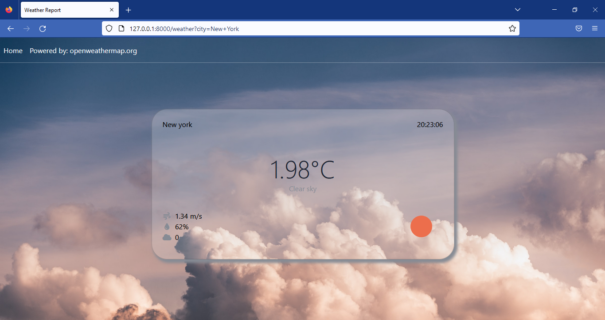

# Weather information Application
 
 
 
Simple fastapi application to find weather information in cities anywhere in the world using OpenWeatherMap API
## Screen Shots
 
 

 

## Installation
Go to OpenWeatherMap official website(https://openweathermap.org/) and create an account to genarate your API key. 
Clone the project and make an .env file in the root folder of the project. 
Paste your API key as a string called "WEATHER_API_KEY" in the .env file. 
Save the changes and hit uvicorn main:app --reload in the terminial to run the app in local host. 

## Used Technologies
✔️ OpenWeatherMap API 
✔️ FastAPI 

## Used Tools
✔️ VSCode 

